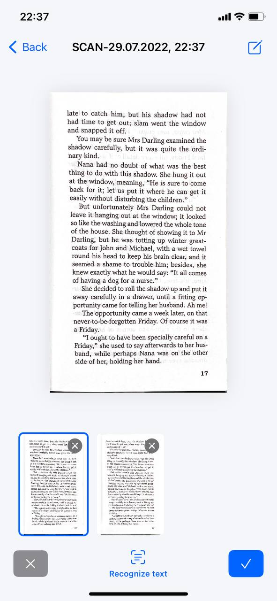

# CamScanner App

### About
An application for scanning and recognising text from an image or camera, creating an PDF file. It is possible to create different folders, all files are stored in a local database CoreData.

## Includes ( ALL SWIFTUI )
- MVVM architecture
- Combine Framework
- Core Data
- VisionKit
- Devices: iphone

## Video

## Screenshots 📷

  

